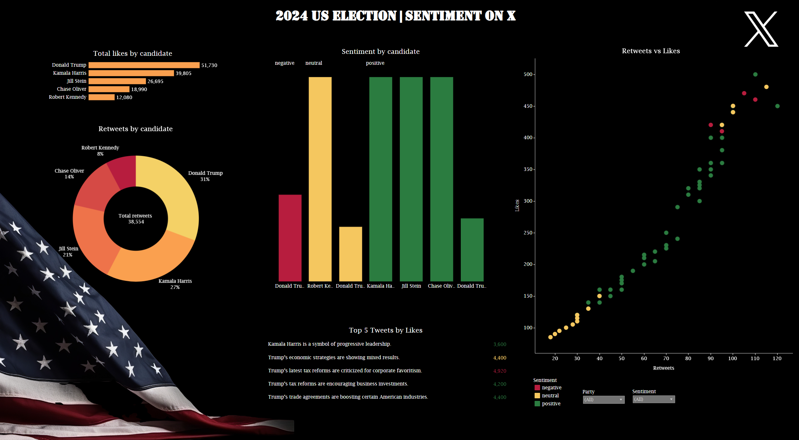

# 2024 U.S. Presidential Race on X: Sentiment Analysis and Trends

## Background and Overview

The 2024 U.S. Presidential election is a pivotal moment in American history, with public sentiment playing a critical role in shaping the election's outcome. Social media platforms, such as X (formerly Twitter), provide a real-time lens into voter opinions, campaign discussions, and societal priorities. This project analyzes a comprehensive dataset of tweets from X, capturing public sentiment and engagement with major candidates, including Kamala Harris, Donald Trump, Jill Stein, Chase Oliver, and Robert Kennedy.

Goal:

As a data analyst, the objective of this project is to uncover actionable insights into voter sentiment, policy discourse, and engagement patterns during the election cycle. This analysis will inform stakeholders about public reactions to key events and the overall digital pulse leading up to the election.

## Data Structure Overview

This dataset contains rich metadata, providing multiple dimensions for analysis:

- Tweet Text: The primary content of the post, offering insights into the language and themes discussed.

- Timestamp: Captures the date and time of the tweet, enabling trend analysis over time.

- User Handle: User identifiers.

- Sentiment Labels: Categorized as positive, negative, or neutral to measure public opinion.

- Engagement Metrics: Retweets and likes, reflecting the reach and popularity of each tweet.

- Party Affiliation: Indicates which political party or candidate the tweet is related to.

This structure facilitates sentiment analysis, trend detection, and clustering of themes across the election timeline.

## Executive Summary

This analysis provides insights into public sentiment and social media engagement for the 2024 U.S. Presidential Race. Key findings include:

1. Candidate Engagement:

**Donald Trump** leads in both total likes (51,730) and retweets (31%) across all candidates, reflecting significant online engagement.

**Kamala Harris** is the second-highest performer, with 39,805 likes and 27% of retweets, indicating strong social media traction.

2. Sentiment Analysis:

Most candidates have a majority of positive sentiment in their mentions.
Donald Trump also has a notable share of negative sentiment, highlighting polarizing public opinion.

3. Content Impact:

Tweets related to tax reforms and trade agreements garnered high likes (up to 4,920), underscoring the relevance of economic issues in voter engagement.
Kamala Harris is associated with tweets portraying her as a progressive leader.

4. Correlation of Likes and Retweets:

The scatter plot suggests a strong positive correlation between likes and retweets, especially for candidates with higher positive sentiment.

Below is the overview page from the Tableau dashboard: 

[Explore the Tableau Visualization](https://public.tableau.com/views/2024USelectionsentimentonX/USElectionSentimentonX?:language=en-US&:sid=&:redirect=auth&:display_count=n&:origin=viz_share_link)

## Recommendations

To maximize the impact of these insights, here are suggested next steps:

For Campaign Teams:

Leverage real-time sentiment analysis to adjust campaign messaging in response to public sentiment shifts.
Focus on high-engagement themes such as economic policies and healthcare to drive voter interest.

For Researchers:

Conduct deeper analysis into specific policy topics to understand voter priorities.
Utilize predictive models to forecast sentiment trends in response to upcoming events.

For Social Media Analysts:

Explore the role of influencers in amplifying campaign messages and shifting public sentiment.
Assess the impact of engagement metrics (e.g., likes, retweets) on public perception of candidates.
This project provides a foundational analysis of the digital dynamics surrounding the 2024 U.S. Presidential Race. Future research can build on these insights to further explore the intersection of social media, voter behavior, and electoral outcomes.